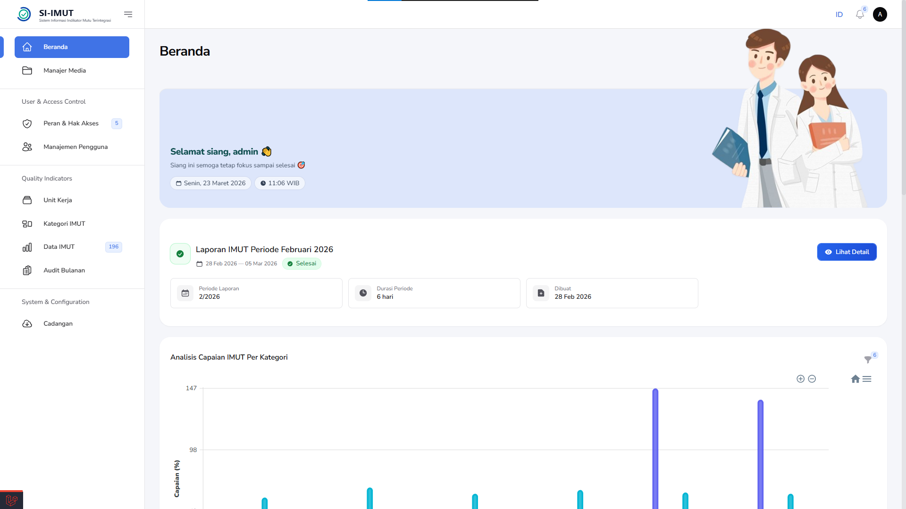
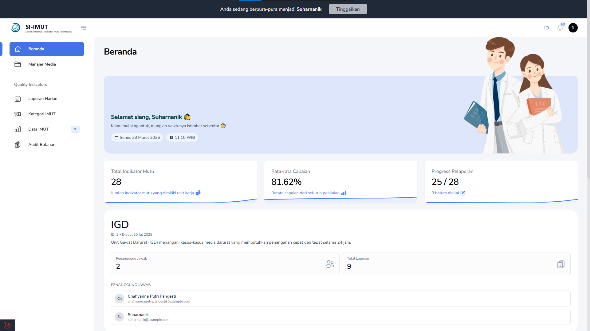

# 🏥 SIIMUT - Sistem Indikator Mutu untuk Rumah Sakit  


**SIIMUT (Sistem Indikator Mutu untuk Rumah Sakit)** adalah platform berbasis web yang dirancang untuk **memantau, menganalisis, dan meningkatkan mutu layanan kesehatan** di rumah sakit Indonesia. Sistem ini selaras dengan standar **Kementerian Kesehatan RI, Komisi Akreditasi Rumah Sakit (KARS), dan SNARS**, memungkinkan institusi kesehatan untuk **mengotomatiskan pengelolaan indikator mutu** guna mendukung peningkatan kualitas layanan berbasis data.  

Dengan meningkatnya tuntutan transparansi, akuntabilitas, dan efisiensi dalam pelayanan kesehatan, SIIMUT hadir sebagai solusi yang **terintegrasi, adaptif, dan berbasis teknologi** untuk membantu rumah sakit dalam pengambilan keputusan strategis serta pemenuhan regulasi nasional.  

## 🎯 Tujuan  

SIIMUT dirancang untuk membantu rumah sakit dalam:  

## 📚 Dokumentasi

### Analisis Proyek (auto-generated)

Ringkasan analisis struktural dan alur kerja aplikasi disimpan di folder `docs/`:

## 🖼️ Preview





*Contoh screenshot: dashboard monitoring indikator mutu, laporan harian, dan grafik tren.*

## 👤 Siapa yang Cocok Menggunakan SIIMUT

- Manajemen rumah sakit (Direksi, MKA)
- Tim mutu (Quality Assurance, Komite Mutu)
- Tim IT / DevOps
- Auditor internal maupun eksternal

## 🏗️ Gambaran Arsitektur

SIIMUT dibangun di atas stack berikut:
- Backend: Laravel 12
- UI/administrasi: Filament 3.2
- Interaktivitas: Livewire + Blade
- PWA/offline: service worker + caching (`generate-cache-pwa.sh`)
- Data: MySQL (default) + Eloquent ORM
- Eksternal: API service, Dynamic SSO

## 🔒 Security

- RBAC (role-based access control) lengkap via permission and policy.
- Audit log: perubahan data, created_by/updated_by, LogsActivity.
- API authentication: Sanctum / token-based API endpoint.
- Protection: CSRF, input validation, dan modul upload file aman.

## 🧪 Testing

- Unit & feature tests tersedia di `tests/`.
- Benchmarking tests (59 tests, 153 assertions) telah di-document di `docs/benchmarking-*`.
- PWA test workflow: `PWA-PRODUCTION-TESTING.md` + `generate-cache-pwa.sh`.


- `docs/ANALYSIS.md` — ringkasan analisis (gambaran umum, komponen, mapping ke LARS, aspek teknis).
- `docs/flow.mmd` — diagram alur (Mermaid) yang menggambarkan lifecycle data indikator → laporan → eviden.
- `docs/module-map.json` — peta modul aplikasi dan kaitannya ke elemen LARS (format JSON).

### Benchmarking System (v1.2.0)

Dokumentasi lengkap sistem benchmarking dengan period validity, cache management, dan schema optimization:

- **[📖 Implementation Guide](docs/benchmarking-system-implementation.md)** — Dokumentasi lengkap implementasi sistem benchmarking
- **[🚀 Quick Start Guide](docs/benchmarking-quick-start.md)** — Panduan cepat penggunaan sistem benchmarking
- **[📚 API Reference](docs/benchmarking-api-reference.md)** — Referensi lengkap API dan method yang tersedia
- **[🎨 UI Improvements](docs/benchmarking-ui-improvements.md)** — Dokumentasi peningkatan antarmuka pengguna (v1.1.0)
- **[⚡ Schema Optimization](docs/benchmarking-schema-optimization.md)** — Optimasi schema menghilangkan kontradiksi year/month (v1.2.0)

**Key Features:**
- ✅ Period validity tracking with flexible date ranges
- ✅ Automatic cache invalidation
- ✅ Comprehensive validation service
- ✅ Audit trail (created_by, updated_by)
- ✅ Factory states for testing
- ✅ 59 tests with 153 assertions (100% pass)
- ✅ Inline table editing for quick data entry
- ✅ **NEW:** Optimized schema - removed year/month redundancy, clearer UX

Silakan lihat file-file tersebut untuk dokumentasi teknis dan peta modul.
✅ **Efisiensi & Akurasi** – Digitalisasi pencatatan dan analisis untuk mengurangi kesalahan manual.  
✅ **Kepatuhan Standar** – Memastikan standar **KARS & SNARS** melalui pemantauan sistematis.  
✅ **Analisis Data** – Laporan real-time dan visualisasi untuk keputusan berbasis bukti.  
✅ **Peningkatan Mutu** – Identifikasi tren, analisis masalah, dan optimalisasi layanan.  
✅ **Akses & Integrasi** – Data terstruktur untuk manajemen, tenaga medis, dan unit mutu. terkoneksi.  

---

## 🚀 Quick Start  

Untuk menginstal dan menjalankan **SIIMUT**, ikuti langkah-langkah berikut:  

### 1️⃣ Clone Repository  
```sh
# Clone repo dan masuk ke folder kerja
git clone https://github.com/juniyasyos/si-imut.git SIIMUT
cd SIIMUT
```  

### 2️⃣ Install Dependensi  
```sh
# Install PHP dependencies dan frontend dependencies
composer install && npm install
# Tunggu hingga kedua proses selesai
composer run post-root-package-install
```  

### 3️⃣ Konfigurasi Lingkungan  
```sh
# Jalankan skrip konfigurasi project Laravel
composer run post-update-cmd
composer run post-create-project-cmd
```
Sesuaikan file `.env` untuk konfigurasi **database**, **s3/Minio**, dan integrasi lainnya.

### 4️⃣ Migrasi Database  
```sh
# Migrasi skema basis data dan seeder default
composer run setup
```  

### 5️⃣ Jalankan Aplikasi  
```sh
# Jalankan mode development
composer run dev
```  

### 4️⃣ Migrasi Database  
```sh
composer run setup
```  

### 5️⃣ Jalankan Aplikasi  
```sh
composer run dev
```  

---

## 🚀 Fitur Terbaru (2026)

- ✅ PWA Production + Offline support (service worker + `generate-cache-pwa.sh` + cache monitoring via `Cache Storage`).
- ✅ Daily Report Harian live (polling/Livewire) dengan auto-reporting terbaru secara real-time, direct update dashboard saat submit.
- ✅ Form Builder canggih (mirip Google Form): template form versioning, field config, compliance scoring, pilihan versi form untuk dipakai per periode.
- ✅ `Imut Data Notes` CRUD: catatan analisis, rekomendasi, prioritas, period tracking, related report relations, audit trail (SoftDeletes + LogsActivity).
- ✅ Livewire Reporting (komponen `ImutIndicatorReport`) dengan reactive filtering, print-ready layout, unit kerja progress, benchmark comparisons.
- ✅ Unit Kerja Media Enhancements: folder sync, media structure, migrasi data existing, backup/export support.
- ✅ Benchmarking engine v1.2.0: period validity (start/end), cache invalidation, region/level keying, schema cleanup (year/month redundant removed), improved queries.
- ✅ Export enhancements (Browsershot): PDF generation, Excel, dynamic report export, print/report route.
- ✅ Dynamic SSO and API service support untuk integrasi identitas rumah sakit.
- ✅ Improved performance nosql & livewire optimizations (fast-load query builder, Lazy loading data, Livewire caching support).

## 🔍 Perbandingan Fitur Lama vs Fitur Terbaru

- Lama: fokus global (manajemen indikator, dashboard umum, RBAC, default export). 
- Baru: fokus modul feature-specific (Imut Data Notes, Livewire report, PWA offline, Unit Kerja media, benchmarking period validity, service worker troubleshooting).
- Lama: kata-kata umum; Baru: by-detail engineer with file path, migration, and widget implementations.
- Lama: single reference `benchmarking` sebagai titik pusat; Baru: explain akses UI, live data/states, plus multiple enhancements (`docs/` spesifik cara pakai).

## 🗓️ Daily Report Harian (Breakthrough Feature)

- Sistem menerima input harian (daily report) dengan mekanisme live update (Livewire/fullstack polling) sehingga laporan terbaru langsung muncul di dashboard.
- Otomatis menjumlahkan numerator/denominator, menghitung persentase, dan menandai trend (uptick/downtick) pada tiap unit kerja.
- Dilengkapi `Form Template Versioning`:
  - `form_templates` menyimpan konfigurasi versi form.
  - `enhanced_form_fields`, `form_field_options`, `field_responses` mendukung compliance scoring per field.
  - Pengguna bisa pilih versi form (v1/v2/v3) untuk periode tertentu atau usecase unit kerja.
- Komponen format input menyerupai Google Form:
  - field type (text, number, radio, checkbox, select, date, time, long text)
  - required/optional, validation rules, conditional fields, auto-calc scoring
  - optional critical fields + auto-fail logic
- Supported flows:
  - create/edit template
  - assign template ke unit kerja/periode
  - submit daily data + realtime update total dashboard
  - historical reporting + compare per version
- Benefit utama:
  - data entry terstandardisasi, minim human error
  - report selalu up-to-date (inline live view)
  - flexible adaptasi perubahan indikator tanpa rebuild code

## ⚙️ Fitur Utama

### 🔹 Core Features
- Pemantauan indikator mutu berdasarkan **standar KARS & SNARS**.
- Penyimpanan data historis untuk **analisis tren dan evaluasi mutu**.
- Notes/analisis terhubung ke setiap `ImutData` dengan prioritas dan lifecycle management.
- Livewire report untuk filtering real-time dan print-ready report.
- PWA + offline support untuk deployment production (cache manifest, service worker).

### 🔹 Technical Features
- **Role-Based Access Control (RBAC)** untuk memastikan akses data hanya bagi pihak yang berwenang.
- **Audit log** untuk melacak perubahan dan aktivitas pengguna (LogsActivity pada catatan data).
- Dynamic SSO / API authentication integration.
- **Dukungan API** untuk integrasi dengan sistem lain.
- Struktur modular (Filament resources, Schema\*, Tables\*).
- Export PDF/Excel dari Browsershot dan custom export pipeline.

### 🔹 Live Reporting & Form Management
- Daily Report Harian live (polling/Livewire) dengan auto-reporting realtime.
- Form Builder canggih (mirip Google Form): template form versioning, field config, compliance scoring, pilihan versi form untuk setiap periode.

---

## 🔧 Konfigurasi  

### **Konfigurasi Database**  
Edit file `.env` dengan kredensial database:  
```ini
DB_CONNECTION=mysql
DB_HOST=127.0.0.1
DB_PORT=3306
DB_DATABASE=siimut
DB_USERNAME=root
DB_PASSWORD=
```  

### **Konfigurasi Email (Opsional)**  
```ini
MAIL_MAILER=smtp
MAIL_HOST=smtp.mailtrap.io
MAIL_PORT=2525
MAIL_USERNAME=
MAIL_PASSWORD=
MAIL_FROM_ADDRESS="admin@rs-example.com"
MAIL_FROM_NAME="SIIMUT RS"
```

---

## 📁 Struktur Resource Filament

Untuk menjaga kode tetap terorganisir, konfigurasi `form` dan `table` pada resource Filament dipisahkan ke dalam kelas khusus. Resource seperti `RoleResource`, `ImutCategoryResource`, `ImutDataResource`, `ImutPenilaianResource`, `ImutProfileResource`, `LaporanImutResource`, `UnitKerjaResource`, dan `UserResource` kini memanfaatkan struktur `Schema\*` dan `Tables\*` sehingga lebih mudah dirawat dan dikembangkan.

---

## 📢 Mengapa Memilih SIIMUT?

SIIMUT dirancang khusus untuk mendukung **rumah sakit di Indonesia** dalam:  
✔ **Efisiensi Pemantauan** – Proses pelacakan indikator mutu lebih cepat dan akurat.  
✔ **Kepatuhan Regulasi** – Memastikan rumah sakit memenuhi standar **KARS & SNARS**.  
✔ **Dukungan Keputusan** – Laporan berbasis data untuk perbaikan mutu berkelanjutan.  
✔ **Keamanan & Skalabilitas** – Sistem aman dengan kemampuan ekspansi yang fleksibel.  

---

## 🤝 Kontribusi  

Kami menyambut kontribusi dari komunitas! Untuk berkontribusi:  
1. **Fork repositori ini**  
2. **Buat branch fitur baru** (`git checkout -b feature/nama-fitur`)  
3. **Commit perubahan Anda** (`git commit -m 'Menambahkan fitur baru'`)  
4. **Push ke branch Anda** (`git push origin feature/nama-fitur`)  
5. **Buka Pull Request**  

---

## 💬 Dukungan & Komunitas  

📌 **Laporkan Bug** – [Buka Issue](https://github.com/juniyasyos/siimut_rs_citrahusada/issues)  
💡 **Usulan Fitur** – [Request Fitur](https://github.com/juniyasyos/siimut_rs_citrahusada/issues)  
📧 **Kontak** – [Email Support](mailto:your-email@example.com)  

---

## ⭐ Dukung Proyek Ini  

Jika **SIIMUT** bermanfaat, jangan lupa **beri ⭐ di GitHub** dan bantu sebarkan! 🚀  

