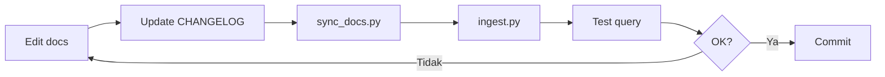

# Aturan Update Dokumentasi

Panduan untuk menulis dan memperbarui dokumentasi project SIIMUT.
Berlaku untuk semua kontributor (manusia dan AI agents).

---

## 📋 Aturan Dasar

### 1. Lokasi File

| File | Lokasi | Fungsi |
|---|---|---|
| Dokumentasi utama | `docs/*.md` | Panduan, referensi, arsitektur |
| Release notes | `docs/releases/vX.Y.Z.md` | Catatan rilis per versi |
| Panduan upgrade | `docs/upgrade/*.md` | Panduan migrasi teknis |
| AI agents | `docs/ai-agents/*.md` | Konfigurasi agen AI |
| Gambar | `docs/images/` | Screenshot, diagram, ilustrasi |
| Root docs | `AGENTS.md`, `CHANGELOG.md` | Root-level dokumentasi |
| RAG system | `docs/ai-agent/rag/*` | Knowledge base query |
| Template release | `docs/releases/template.md` | Template — **jangan di-copy ke docs/ai-agent/rag/input/** |

### 2. Format Markdown

```markdown
# Judul H1 — Nama Dokumen

## Ringkasan

Paragraf pengantar singkat.

---

## Heading H2 — Section Utama

### Heading H3 — Sub-section

Teks biasa dengan **bold** untuk penekanan.

| Table | Header |
|---|---|
| Data 1 | Data 2 |

`kode inline` untuk variabel, command, file path.

```bash
# code block untuk command
php artisan migrate
`` `
```

### 3. Bahasa

- **Dokumentasi teknis**: Bahasa Indonesia (konsisten)
- **Kata teknis**: Boleh Inggris (service, database, deployment)
- **File tertentu**: Inggris jika kontennya spesifik (SBOM.md, LICENSE)
- **Konsisten dalam satu file** — jangan campur ID/EN dalam paragraf yang sama

### 4. Frontmatter / Metadata

Setiap issue di KNOWN_ISSUES.md wajib punya:

```
- **ID**: KI-001
- **Status**: Open / Resolved / Needs Verification
- **Severity**: Critical / High / Medium / Low
- **Area**: Arsitektur / Konfigurasi / Dependency / Performance / Security / UI
```

Setiap decision di DECISIONS.md wajib punya:

```
- **ID**: DEC-001
- **Tanggal**: YYYY-MM-DD
- **Status**: Active / Implemented / Deprecated
- **Context**: ...
- **Decision**: ...
- **Reason**: ...
- **Impact**: ...
```

### 5. Template Release Notes

Gunakan `docs/releases/template.md` untuk membuat release note baru.
Template ini TIDAK di-copy ke `docs/ai-agent/rag/input/` oleh sync_docs.py.

---

## 🚫 Larangan

| Larangan | Alasan |
|---|---|
| Jangan scan `vendor/`, `node_modules/`, `storage/`, `logs/`, `build/` | Performa, file raksasa, binary |
| Jangan hardcode API key atau secret | Keamanan |
| Jangan ubah source code utama tanpa approval | Stabilitas aplikasi |
| Jangan hapus dokumentasi lama tanpa migrasi | Traceability |
| Jangan buat relasi graph yang tidak yakin | Akurasi knowledge base |

---

## ✅ Checklist Update Docs

- [ ] File baru dibuat / diedit
- [ ] Format markdown konsisten
- [ ] Link internal valid
- [ ] ID issue/decision terisi lengkap
- [ ] CHANGELOG.md diupdate (jika perubahan signifikan)
- [ ] RAG di-rebuild (sync_docs + ingest)
- [ ] Tidak ada secret/hardcode yang ter-expose

---

## 🔄 Workflow Update


