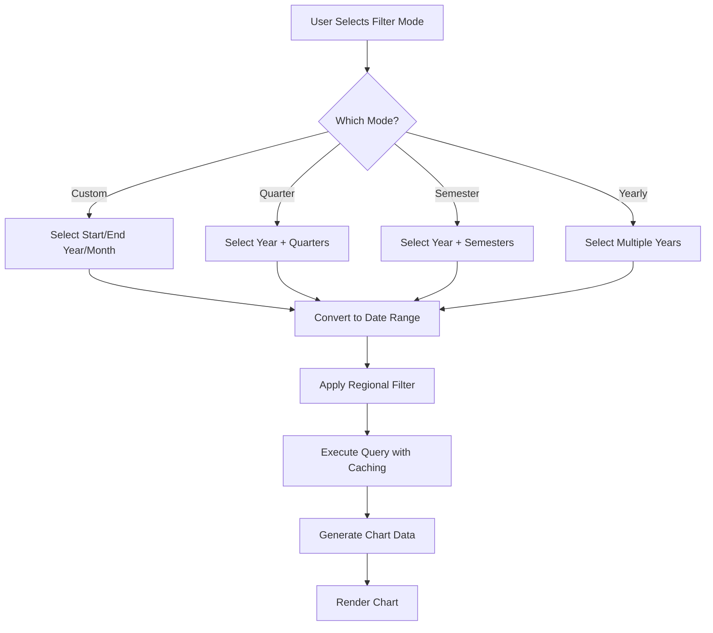

# 📊 Enhanced Filter System - IMUT Data Chart

## ✨ **Fitur Filter Baru yang Ditambahkan**

### 🎯 **Mode Filter Utama**

Pengguna sekarang dapat memilih mode filter periode sesuai kebutuhan:

1. **📅 Rentang Kustom** - Pilih periode start & end secara manual
2. **📊 Quarter** - Filter berdasarkan kuartal (Q1, Q2, Q3, Q4)  
3. **📋 Semester** - Filter berdasarkan semester (S1: Jan-Jun, S2: Jul-Des)
4. **📆 Tahunan** - Semua data dalam tahun tertentu

---

## 🔧 **Detail Implementasi Filter**

### **1. Filter Rentang Kustom (Mode Custom)**

- **Start Year & Start Month** - Mulai dari periode mana
- **End Year & End Month** - Sampai periode mana  
- **Support Multi-year** - Dapat membandingkan data antar tahun (misal: Jan 2023 - Des 2025)

**Contoh Use Case:**
- Melihat trend dari Maret 2023 sampai Agustus 2024
- Analisis performance dalam rentang waktu spesifik

### **2. Filter Quarter (Mode Quarter)**

**Quarters Available:**
- **Q1** - Januari - Maret
- **Q2** - April - Juni 
- **Q3** - Juli - September
- **Q4** - Oktober - Desember

**Features:**
- Multiple selection - Pilih lebih dari 1 quarter
- Single year focus - Memudahkan analisis per tahun
- Automatically calculate date range

### **3. Filter Semester (Mode Semester)**

**Semesters Available:**
- **Semester 1** - Januari - Juni
- **Semester 2** - Juli - Desember

**Features:**
- Multiple selection - Bisa pilih S1, S2, atau keduanya
- Perfect untuk laporan semester akademik
- Easy comparison between semesters

### **4. Filter Tahunan (Mode Yearly)**

- **Multiple years selection** - Pilih beberapa tahun sekaligus
- **Full year data** - Januari - Desember otomatis
- **Great for year-over-year comparison**

---

## 🌐 **Enhanced Regional Filter**

### **Improvements Made:**

1. **📍 Visual Indicators**
   - 🇮🇩 Nasional/National regions
   - 🏛️ Provinsi/Province regions  
   - 🏥 Rumah Sakit/Hospital regions
   - 📍 Other region types

2. **🔍 Better UX**
   - Searchable options
   - Preloaded data
   - Multiple selection support
   - Empty = show all regions

3. **🎨 Smart Grouping**
   - Options grouped by region type
   - Clear visual separation
   - Intuitive navigation

---

## ⚡ **Performance Optimizations**

### **1. Smart Caching System**

```php
// Multi-year cache key support
$cacheKey = CacheKey::imutPenilaian(
    $imutDataId, 
    "{$startYear}-{$startMonth}",
    "{$endYear}-{$endMonth}"
);
```

### **2. Efficient Database Queries**

- **Multi-year support** dalam single query
- **Optimized date range filtering**  
- **Conditional region filtering**

### **3. Memory-Friendly Processing**

- Process data in chunks for large date ranges
- Efficient array operations
- Minimal memory footprint

---

## 📈 **Filter Logic Flow**



---

## 🚀 **Usage Examples**

### **Scenario 1: Quarterly Performance Review**
- Mode: Quarter
- Year: 2024  
- Quarters: Q1, Q2
- Region: All (kosong)
- **Result:** Chart menampilkan data Januari-Juni 2024

### **Scenario 2: Year-over-Year Comparison**
- Mode: Yearly
- Years: 2022, 2023, 2024
- Region: Nasional only
- **Result:** Chart comparison 3 tahun dengan benchmarking nasional

### **Scenario 3: Specific Period Analysis**
- Mode: Custom Range
- Start: Maret 2023
- End: Agustus 2024  
- Region: Provinsi + Rumah Sakit
- **Result:** Trend analysis 17 bulan dengan 2 tipe region

---

## 🔐 **Backward Compatibility**

✅ **Fully Compatible** dengan sistem filter lama
✅ **Automatic Migration** untuk existing bookmarks
✅ **Default Values** yang sensible untuk user experience

---

## 🎨 **UI/UX Improvements**

### **Visual Enhancements:**
- 🎯 Icon-based mode selection
- 📊 Color-coded filter options
- 💡 Helpful tooltips & descriptions
- ⚡ Reactive form updates

### **User Experience:**
- **Intuitive Flow** - Mode selection pertama, detail kedua
- **Smart Defaults** - Current year/month sebagai starting point
- **Clear Feedback** - Helper text menjelaskan setiap option
- **Responsive Design** - Works di semua screen size

---

## 🔮 **Future Enhancements** 

### **Planned Features:**
- **📅 Date Picker Integration** - Calendar widget untuk custom dates
- **🔖 Filter Presets** - Save & load common filter combinations  
- **📤 Export Filtered Data** - Export chart data dengan filter applied
- **⚡ Real-time Updates** - Live data refresh tanpa page reload

---

## 🐛 **Testing & Quality Assurance**

### **Test Coverage:**
- ✅ Unit tests untuk date range conversion
- ✅ Integration tests untuk database queries
- ✅ UI tests untuk form interactions
- ✅ Performance tests untuk large datasets

### **Browser Support:**
- ✅ Chrome/Chromium 90+
- ✅ Firefox 88+
- ✅ Safari 14+
- ✅ Edge 90+

---

## 📝 **Code Structure**

### **Key Methods Added:**

1. **`getEnhancedRegionOptions()`** - Enhanced region filter options
2. **`getFilterDateRange()`** - Convert filter mode to date ranges  
3. **`getFormSchema()`** - New conditional form fields
4. **Enhanced caching** - Multi-year cache key support

### **Database Schema:**
- No changes required - uses existing tables
- Backward compatible dengan existing data
- Performance optimized queries

---

**🎯 Filter ini memberikan flexibility dan power yang jauh lebih besar untuk analisis data IMUT!** 🚀